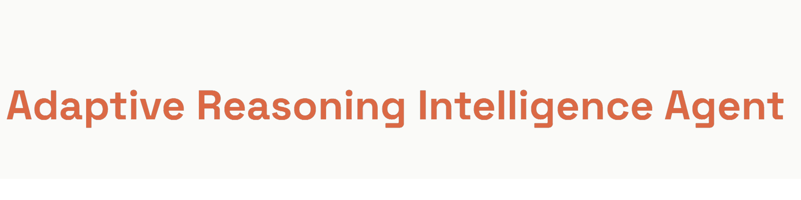

# **This is a research tool. The author is not responsible for misuse, training data, or generated content.**

> **Legal notice:** I have nothing to do with anyone who uses this tool for illegal purposes. If you train my AI model and use it for hacking, criminal activity, or any other unlawful actions, that is entirely your own responsibility and problem.


# ARIA Atom 3.3.0



**ARIA Atom 3.3.0** — локальная языковая модель на основе GPT-style Transformer с обучением на диалоговых данных, написанная на Rust. Вычисления выполняются на NVIDIA GPU через CUDA/cuBLAS с кастомными PTX ядрами.

> **Важно:** ARIA поддерживает только видеокарты NVIDIA. Работа на AMD, Intel и других GPU не гарантируется.

| Версия | Кодовое имя | Архитектура | Параметры |
|---|---|---|---|
| 3.2.0 | Wotan | LSTM (1 слой) | ~44.5M |
| **3.3.0** | **Atom** | **Transformer (12 слоёв)** | **~124M** |

## Архитектура (3.3.0 Atom)

```
Тип:           GPT-style decoder-only Transformer
Слои:          12
d_model:       768
Головы:        12  (head_dim = 64)
FFN dim:       3072  (4 × d_model)
Макс. контекст: 256 токенов
Словарь:       32 000 (BPE)
Weight tying:  embed ↔ output projection
Параметры:     ~124M
Точность:      FP16 веса + FP32 моменты Adam
```

### VRAM (batch=64, seq=256)

| Компонент | Размер |
|---|---|
| Веса FP16 | ~248 МБ |
| Моменты Adam FP32 | ~992 МБ |
| Активации | ~900 МБ |
| Веса внимания | ~600 МБ |
| Градиенты | ~900 МБ |
| Прочее | ~200 МБ |
| **Итого** | **~3.8 ГБ** |

Помещается в 8 ГБ VRAM с запасом.

## Требования

### Обязательное ПО

| Компонент | Версия | Скачать |
|---|---|---|
| Rust + Cargo | stable (2021 edition) | https://rustup.rs |
| Visual Studio Build Tools | 2017 или новее | https://visualstudio.microsoft.com/visual-cpp-build-tools/ |
| NVIDIA CUDA Toolkit | 12.x | https://developer.nvidia.com/cuda-downloads |
| Драйвер NVIDIA | актуальный | https://www.nvidia.com/drivers |

### Установка Build Tools (обязательно для Windows)

1. Скачай **Build Tools for Visual Studio** по ссылке выше.
2. В установщике выбери компонент **"Desktop development with C++"**.
3. Установи (~3-5 ГБ).
4. Перезапусти терминал.

> VS Code — это другой продукт и для компиляции **не подходит**.

## Запуск

```bash
# Клонировать репозиторий
git clone https://github.com/USER/ARIA.git
cd ARIA

# Собрать (release)
cargo build --release

# Запустить чат
.\target\release\aria.exe
```

При первом запуске ARIA автоматически:
1. Создаёт папку `data base/` с пустыми файлами датасетов.
2. Строит BPE-словарь (32 000 токенов) из диалоговых данных.
3. Инициализирует Transformer модель (~124M параметров).
4. Проводит предобучение на данных из `data base/`.
5. Сохраняет чекпоинт в `aria json/aria_checkpoint.json` и токенизатор в `aria json/aria_tokenizer.json`.

При последующих запусках модель загружается из сохранённых файлов.

### Обучение с нуля

```powershell
.\target\release\train_fresh.exe
```

Строит словарь и обучает модель с нуля на файле `data base/DataBase_roles.jsonl`.

### Дообучение (SFT) от чекпоинта

```powershell
.\target\release\sft_train.exe
```

### Продолжение обучения через main

```powershell
$env:ARIA_CONTINUE_TRAIN="1"
.\target\release\aria.exe
```

### Тестирование модели

```powershell
# Жадная генерация по набору промптов
.\target\release\greedy_test.exe

# Top-K и Top-P тесты с разными температурами
.\target\release\sample_test.exe

# Полный набор тестов с сохранением отчёта
.\target\release\test_suite.exe

# Инференс по одному промпту
.\target\release\inference.exe "привет"

# Отладка логитов
.\target\release\debug_logits.exe
```

## Обучение

### Что нужно для обучения

- Видеокарта **NVIDIA** (обязательно, вычисления идут через CUDA/cuBLAS).
- VRAM: рекомендуется **8 ГБ** и более.
- RAM: от **16 ГБ**.
- Диалоговый датасет в формате JSONL в папке `data base/`.

### Файлы датасетов

```
data base/
  DataBase_roles.jsonl   - основной диалоговый датасет (формат: {"text": "..."})
  DataBase.txt           - дополнительные тексты (опционально)
  Words.txt              - словарный запас (опционально)
```

Каждая строка `DataBase_roles.jsonl` — отдельный диалог в формате:
```json
{"text": "Пользователь: привет\nАссистент: привет, чем могу помочь?"}
```

При обучении токенизатор автоматически вставляет ролевые токены `<USER>` / `<ASSISTANT>` и обучается только на токенах ассистента (маскирование потерь).

### Параметры обучения (переменные окружения)

| Переменная | Описание | Значение по умолчанию |
|---|---|---|
| `ARIA_LR` | Learning rate | 0.0003 |
| `ARIA_CLIP` | Gradient clipping | 5.0 |
| `ARIA_MAX_SEQS` | Максимум последовательностей на эпоху | 15 000 000 |
| `ARIA_EPOCHS` | Количество эпох | 5 |
| `ARIA_VOCAB_LINES` | Строк для построения словаря | 2 000 000 |
| `ARIA_CONTINUE_TRAIN` | Продолжить предобучение | — |

Пример — тестовый запуск на 100k последовательностей:

```powershell
$env:ARIA_MAX_SEQS="200000"
$env:ARIA_EPOCHS="1"
.\target\release\train_fresh.exe
```

Полное обучение:

```powershell
$env:ARIA_MAX_SEQS="15000000"
$env:ARIA_EPOCHS="5"
.\target\release\train_fresh.exe > train_transformer.log
```

Ожидаемое время: ~3-4 часа на эпоху на RTX 4060.

## Команды в диалоге

| Команда | Описание |
|---|---|
| `stats` | Показать статистику сессии |
| `settings` | Показать текущие настройки генерации |
| `mode greedy` | Жадная генерация (детерминированная) |
| `mode topk` | Top-K сэмплинг (k=20, по умолчанию) |
| `mode topp` | Nucleus (top-p) сэмплинг (p=0.9) |
| `temp <0.1-2.0>` | Установить температуру генерации |
| `topk <n>` | Установить значение K |
| `topp <0.0-1.0>` | Установить значение P |
| `exit` | Выйти |

## Файлы, создаваемые при работе

| Файл | Описание |
|---|---|
| `aria json/aria_checkpoint.json` | Веса модели, конфигурация и состояние оптимизатора |
| `aria json/aria_tokenizer.json` | Словарь токенизатора (BPE, 32K) |
| `aria json/aria_dialogs.json` | Зашифрованная история диалогов |
| `data base/sequences_cache_transformer_v*.bin` | Кеш токенизированных последовательностей |
| `logs/validation_log.txt` | Отчёт после `test_suite` |

## Возможные проблемы

**`error: linker link.exe not found`**
Установи Visual Studio Build Tools с компонентом C++ (см. раздел выше).

**Модель не видит GPU**
Убедись, что установлен драйвер NVIDIA и CUDA Toolkit 12.x. CUDA должна быть доступна через `nvcc`.

**Несовместимый чекпоинт**
Чекпоинты версии 3.2.0 (LSTM, формат `checkpoint_v1`) несовместимы с 3.3.0 (Transformer, формат `transformer_v1`). Удали старый `aria_checkpoint.json` и запусти `train_fresh.exe`.

**Медленное обучение**
Используй только `cargo build --release` и запускай `.exe` напрямую. Debug-сборка в 10-20 раз медленнее.

**Низкое качество генерации**
1. Проверь чистоту и формат данных в `data base/`.
2. Убедись, что диалоги имеют структуру `Пользователь: ...\nАссистент: ...`.
3. Проверь `logs/validation_log.txt` после `test_suite`.
4. Увеличь количество эпох или объём данных.
